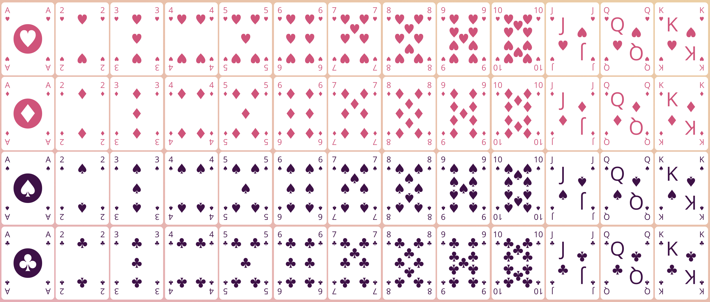

This was my first attempt at making a tutorial on styling tools for React. It shows how to used Styled Components and React Transition Group to build the UI for a poker game. I ultimately decided that the material here is too advanced for beginners, so I made a [simpler](/projects/pokemon-team-builder) project instead. Nonetheless, the project nicely demonstrates what can be done to simplify complex animations in React. It also shows off some what can be done with CSS-powered 3D animations.

The first demonstration covers how to make playing card faces with CSS. Doing this by defining classes and applying them to elements is possible, but pretty tedious. It's much easier with Styled Components--all we have to do is make some data that defines how elements should be placed on each card face and then define a component that translates this data into styles.

I then build a card that can flip in 3D. This requires pasting card faces and card backs together, and then applying a 3D transformation. I put some care into making the transformation look natural--in addition to rotating in space, the card also translates up and back at the start of its animation. I tried to get the timing functions right so it would look as close as possible to the motion involved in pulling back and then revealing a card.

<iframe src="https://player.vimeo.com/video/450663778" title="Card Flip" w="640" h="377" frameborder="0" allow="autoplay; fullscreen" allowfullscreen></iframe>

I've had a few students who want to know how to toggle the global styles of their application. One way to do this with Styled Components is to use the ThemeProvider API. It's built on top of React's Context API, which it uses to make variables available to all of the styled components in a project. These variables can store colors, giving us a straightforward way to toggle the color scheme across an entire application.

<iframe src="https://player.vimeo.com/video/450681643" title="Theme Change" w="640" h="382" frameborder="0" allow="autoplay; fullscreen" allowfullscreen></iframe>

Finally, I updated the cards so that they could be translated and rotated around in space, in addition to being flipped over. I added in some state for the poker game itself and buttons to control this state. From there, all that's left to be done is set up the right mapping between game state and card position on the table.

<iframe src="https://player.vimeo.com/video/450686583" title="Poker Gameplay" w="640" h="358" frameborder="0" allow="autoplay; fullscreen" allowfullscreen></iframe>